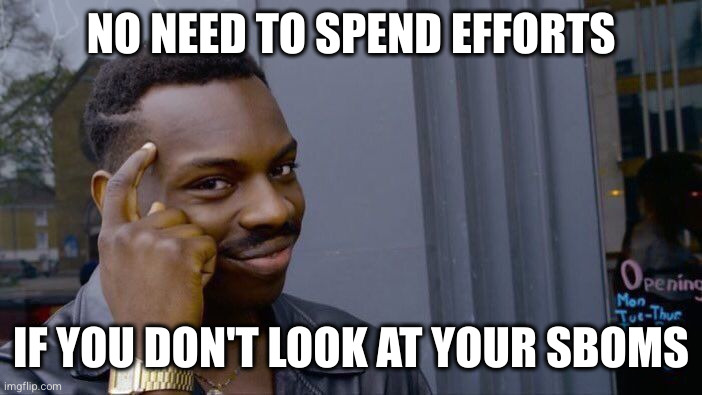

 <!-- .element: class="hidden" data-fragment-index="2" -->

# SBOMs
## Eine Tragikomödie in 3 Akten

_by *Jasmin Mair* and *Lukas Mika*_

Note:
This slide deck is based on [reveal.js](https://revealjs.com/).

This file provides the Payload for the presentation and might therefore contain code, which is not natively supported by GitHub's MarkDown implementation.

The rendered presentation is available via the repository's [GitHub Pages website](https://something-appsec.github.io/sbom-talk/).

---

# Disclaimer

All characters appearing in this work  
are purely fictitious.

Any resemblance to real persons, living or dead,  
is purely coincidental.

---

No CISOs were harmed  
in the Making of this Presentation

---

# 1. Akt

## _Introductio_

---

<figure>
    
    <figcaption><a href="https://www.sonatype.com/hubfs/1-2023%20New%20Site%20Assets/SSCR/8th-Annual-SSCR-digital-0206%20update.pdf">Sonatype: 2022 State of the Supply Chain</a></figcaption>
</figure>

---

---

 

---

---

<figure>
    
    <figcaption><a href="https://blog.droidchef.dev/mastering-the-gradle-dependency-tree/">Ishan Khanna: Mastering the Gradle Dependency Tree</a></figcaption>
</figure>

---

<figure>
    
    <figcaption><a href="https://www.intel.com/content/www/us/en/developer/articles/guide/the-careful-consumption-of-open-source-software.html">Intel: The Careful Consumption of Open Source Software</a></figcaption>
</figure>

---

---

---

<figure>
    
    <figcaption><a href="https://blog.phylum.io/hidden-dependencies-lurking-in-the-software-dependency-network/">Phylum: Hidden Dependencies lurking in the Software Dependency Network</a></figcaption>
</figure>

---

<figure>
    
    <figcaption><a href="https://understandlegacycode.com/blog/safely-restructure-codebase-with-dependency-graphs/">Nicolas Carlo: Safely restructure your codebase with Dependency Graphs</a></figcaption>
</figure>

---

# SBOM

- Supplier Name
- Component Name
- Version of the Component
- Other Unique Identifiers
- Dependency Relationship
- Author of SBOM Data
- Timestamp
- Licenses

<!--
- Component (incl. Identifiers)
- Used Version
- Creator
- Timestamp
- Filename
- Dependencies on others
- License
- Origin
- Relations
-->

---

---

# 2. Akt

## _Disputatio_

---

<figure>
    
    <figcaption><a href="https://www.sonatype.com/state-of-the-software-supply-chain/2024/10-year-look">Sonatype: 2024 State of the Supply Chain</a></figcaption>
</figure>

---

<figure>
    
    <figcaption><a href="https://www.sonatype.com/state-of-the-software-supply-chain/2024/10-year-look">Sonatype: 2024 State of the Supply Chain</a></figcaption>
</figure>

---

<figure>
    
    <figcaption><a href="https://www.sonatype.com/state-of-the-software-supply-chain/2024/10-year-look">Sonatype: 2024 State of the Supply Chain</a></figcaption>
</figure>

---

<figure>
    
    <figcaption><a href="https://www.blackduck.com/content/dam/black-duck/en-us/reports/rep-ossra.pdf">Black Duck: 2025 Open Source Security and Risk Analysis Report</a></figcaption>
</figure>

---

<figure>
    
    <figcaption><a href="https://www.intel.com/content/www/us/en/developer/articles/guide/the-careful-consumption-of-open-source-software.html">Intel: The Careful Consumption of Open Source Software</a></figcaption>
</figure>

---

# Sponsor more open source projects!

---

---

---

<figure>
    
    <figcaption><a href="https://www.cisa.gov/sites/default/files/2024-05/SBOM%20Sharing%20Primer.pdf">CISA: SBOM Sharing Primer</a></figcaption>
</figure>

---

---

Hier fehlt eine Slide zum Thema "Konsolidierung"

---

# Supply Chain Attack Vectors

- Typosquatting
- Malicious Code Injection
  - Social Engineering
  - Compromised Build Systems
  - Repo-/Project-jacking
- Malicious Maintainer (e.g. "Protestware")
- Dependency Confusion/Hallucination

---

---

---

<figure>
    
    <figcaption><a href="https://www.cve.org/CVERecord?id=CVE-2021-44228">CVE-2021-44228 on https://cve.mitre.org/</a></figcaption>
</figure>

---

<figure>
    
    <figcaption><a href="https://www.reuters.com/world/us/us-agency-extends-support-last-minute-cyber-vulnerability-database-2025-04-16/">Reuters: In last-minute reversal, US agency extends support for cyber vulnerability database</a></figcaption>
</figure>

---

<figure>
    
    <figcaption><a href="https://euvd.enisa.europa.eu/">https://euvd.enisa.europa.eu/</a></figcaption>
</figure>

---

<figure>
    
    <figcaption><a href="https://blog.adolus.com/a-deeper-dive-into-vex-documents">Adolus: A Deeper Dive into VEX Documents</a></figcaption
</figure>

---

# 3. Akt

## _Conclusio_

---

---

| **Regulation**           | **Industry**                     |
|--------------------------|----------------------------------|
| NIS-2 Directive          | Critical Infrastructure          |
| EU Cyber Resilience Act  | "Products with digital Elements" |
| DORA                     | Financial Sector                 |
| US Executive Order 14028 | US Government Software Suppliers |
| FDA                      | Medical Devices                  |
| UNECE R 155 WP.29        | Automotive (self-driving cars)   |

---

---

---

<figure>
    
    <figcaption><a href="https://www.sonatype.com/state-of-the-software-supply-chain/2024/risk">Sonatype: 2024 State of the Supply Chain</a></figcaption>
</figure>

---

<figure>
    
    <figcaption>Example OpenSSF Scorecard Report; see <a href="https://scorecard.dev/">https://scorecard.dev/</a></figcaption>
</figure>

---

---

Slides and Content available at https://github.com/something-appsec/sbom-talk

