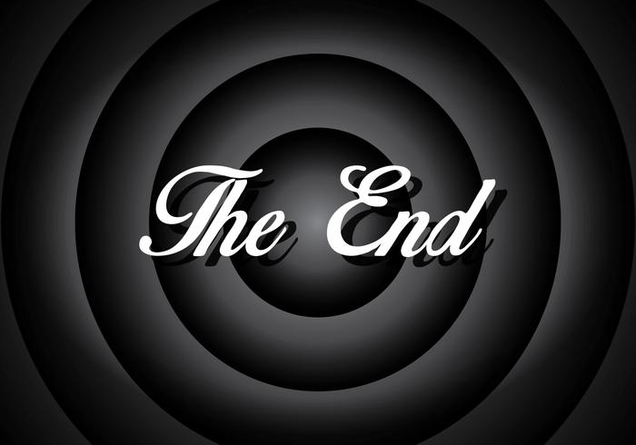

# SBOMs
## Eine Tragikomödie in 3 Akten

_by *Jasmin Mair* and *Lukas Mika*_

Note:
This slide deck is based on [reveal.js](https://revealjs.com/).

This file provides the Payload for the presentation and might therefore contain code, which is not natively supported by GitHub's MarkDown implementation.

The rendered presentation is available via the repository's [GitHub Pages website](https://dim-0.github.io/sbom-talk/).

---

# Disclaimer

All characters appearing in this work  
are purely fictitious.

Any resemblance to real persons, living or dead,  
is purely coincidental.

---

No CISOs were harmed in the making  
of this presentation

---

# 1. Akt

## _Introductio_

---

<figure>
    
    <figcaption><a href="https://www.sonatype.com/hubfs/1-2023%20New%20Site%20Assets/SSCR/8th-Annual-SSCR-digital-0206%20update.pdf">Sonatype: 2022 State of the Supply Chain</a></figcaption>
</figure>

---

---

 

---

<figure>
    
    <figcaption><a href="https://blog.droidchef.dev/mastering-the-gradle-dependency-tree/">Ishan Khanna: Mastering the Gradle Dependency Tree</a></figcaption>
</figure>

---

# 2. Akt

## _Disputatio_

---

<figure>
    
    <figcaption><a href="https://www.sonatype.com/state-of-the-software-supply-chain/2024/10-year-look">Sonatype: 2024 State of the Supply Chain</a></figcaption>
</figure>

---

# Sponsor open source projects!

---

---

# 3. Akt

## _Conclusio_

---

